# Milestone 2: AWS RAG Application

An end-to-end Retrieval-Augmented Generation (RAG) application that indexes documents from Amazon S3 and answers questions through FastAPI and Streamlit.

## Architecture

```mermaid
flowchart LR
    S3["Amazon S3\nPDF documents"]
    PDF["PyMuPDF\nText extraction"]
    CHUNK["LangChain\nRecursiveCharacterTextSplitter"]
    EMBED["Amazon Bedrock\nTitan Text Embeddings V2"]
    OS["Amazon OpenSearch Service\nk-NN vector index and retriever"]
    LLM["Amazon Bedrock\nLLM via Converse API"]
    RESPONSE["FastAPI POST /ask\nStreamlit Q/A response"]

    S3 -->|"PDF bytes"| PDF
    PDF -->|"Extracted text"| CHUNK
    CHUNK -->|"Chunks plus S3 metadata"| EMBED
    EMBED -->|"Embedding vectors"| OS
    OS -->|"Top-k relevant chunks"| LLM
    LLM -->|"Grounded answer and citations"| RESPONSE
    RESPONSE -->|"Question embedding"| EMBED
    EMBED -->|"Query vector"| OS
```



## Dependencies

Install Python 3.10+ and the libraries in `requirements.txt`:

```bash
cd ~/milestone-2
python -m venv .venv
source .venv/bin/activate
pip install -r requirements.txt
```

Required packages: `boto3`, `PyMuPDF`, `langchain-aws`, `langchain-text-splitters`, `opensearch-py`, `fastapi`, `uvicorn`, `streamlit`, `requests`, `python-dotenv`, `pytest`, and `httpx`.

## AWS Prerequisites

1. Create an S3 bucket and upload text-based PDF documents under a prefix such as `documents/`.
2. Create an Amazon OpenSearch Service domain or Serverless vector collection. Its engine must support `knn_vector` fields.
3. Enable access to `amazon.titan-embed-text-v2:0` and a Converse-compatible chat model in Amazon Bedrock. Change model IDs in `.env` if needed for your region.
4. Configure AWS credentials through `aws configure`, an IAM role, or another standard boto3 credential source.
5. Grant least-privilege IAM access: `s3:ListBucket`, `s3:GetObject`, `bedrock:InvokeModel`, and the required `es:ESHttp*` permissions. OpenSearch Serverless additionally needs matching data-access and network policies.

## Configuration

```bash
cp .env.example .env
```

Set the bucket, OpenSearch endpoint, and AWS Region in `.env`. Keep `OPENSEARCH_SERVICE=es` for a managed domain or set it to `aoss` for OpenSearch Serverless. Do not commit `.env`.

For example, if the S3 console URL shows `s3://company-rag-source/documents/handbook.pdf`, use:

```dotenv
AWS_REGION=us-east-1
S3_BUCKET=company-rag-source
S3_PREFIX=documents/
```

Use only the bucket name in `S3_BUCKET`, not `s3://` and not a file name.

`BEDROCK_EMBEDDING_DIMENSION` must equal the selected embedding model's output dimension and an existing OpenSearch index must use the same dimension. The supplied Titan Text Embeddings V2 default is `1024`.

## Run

### Sample Documents

Three upload-ready text-based PDFs are included in `sample_documents/`:

```text
employee_handbook.pdf
travel_expense_policy.pdf
incident_response_guide.pdf
```

In the S3 Console, open the prefix configured in `S3_PREFIX`, click **Upload** -> **Add files**, and select these three PDF files. Upload only the PDFs; the adjacent HTML files are editable source documents used to generate them.

PyMuPDF extracts embedded PDF text and does not perform OCR. Convert scanned PDFs to searchable PDFs before ingestion.

Index documents. Managed OpenSearch domains use stable chunk IDs; OpenSearch Serverless assigns IDs, so re-ingesting the same files creates additional records.

```bash
PYTHONPATH=src python scripts/ingest_s3.py
```

Start the API in one terminal:

```bash
PYTHONPATH=src uvicorn rag_app.api:app --reload --port 8000
```

Start the UI in another terminal:

```bash
streamlit run streamlit_app.py
```

### Run The Notebook

Start JupyterLab from the project root so the notebook can locate `.env` and the `src` package:

```bash
source .venv/bin/activate
jupyter lab
```

Open `notebooks/rag_walkthrough.ipynb`, select the **Python 3** kernel, and run the cells in order. The notebook runs real AWS ingestion and queries, so complete the AWS configuration first.

Ask the API directly:

```bash
curl -X POST http://localhost:8000/ask \
  -H 'Content-Type: application/json' \
  -d '{"question":"What approval is required?","top_k":4}'
```

The response includes an answer plus each S3 source URI, chunk index, similarity score, and text excerpt.

## Retrieval Quality Test

`evaluation/questions.json` contains 12 questions for the included sample PDFs. It expects the PDFs to be uploaded directly below the `documents/` S3 prefix, then run:

```bash
PYTHONPATH=src python scripts/evaluate_retrieval.py --questions evaluation/questions.json --top-k 4
```

The script does not call the answer LLM. It prints Recall@K, whether each expected document was retrieved, and all returned source keys. Review failed cases by checking the returned chunks and tune chunk size, overlap, or `top_k`; re-ingest after changing chunk settings.

## Unit Tests

The test suite uses fake AWS clients and does not require cloud credentials:

```bash
pytest
```

It covers LangChain chunk metadata and determinism, PyMuPDF PDF extraction, RAG orchestration and validation, plus the `POST /ask` contract.

## Folder Structure

```text
milestone-2/
├── .env.example                 # Required configuration template
├── .gitignore
├── README.md
├── requirements.txt
├── streamlit_app.py             # Q/A frontend
├── evaluation/questions.json    # 12+ retrieval evaluation cases
├── notebooks/rag_walkthrough.ipynb
├── scripts/
│   ├── ingest_s3.py             # Ingestion CLI
│   └── evaluate_retrieval.py    # Recall@K evaluator
├── src/rag_app/
│   ├── api.py                   # FastAPI POST /ask
│   ├── bootstrap.py             # AWS client wiring
│   ├── chunking.py              # LangChain splitting
│   ├── config.py
│   ├── document_loader.py       # S3 and PyMuPDF PDF extraction
│   ├── opensearch_store.py
│   └── services.py              # Ingestion and RAG orchestration
└── tests/                       # Offline unit tests
```
